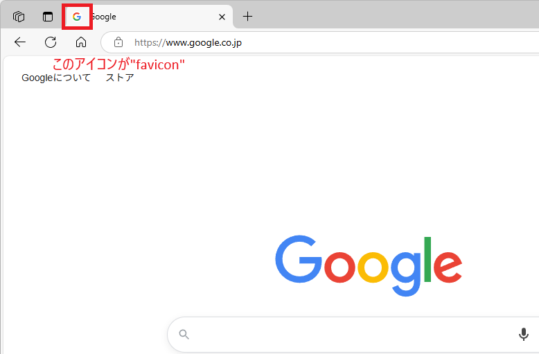

# HTMLの基礎

このディレクトリでは、HTMLの基本的な書き方と構造、学習の方法について解説します。

## 目次
- [HTMLの基礎](#htmlの基礎)
  - [目次](#目次)
  - [HTMLって何？](#htmlって何)
  - [HTMLの基本構造](#htmlの基本構造)
    - [DOCTYPEについて](#doctypeについて)
    - [`<html>`タグについて](#htmlタグについて)
      - [`<html>`タグの代表的な属性](#htmlタグの代表的な属性)
    - [`<head>`タグについて](#headタグについて)
      - [`<head>`タグ内の主要な要素](#headタグ内の主要な要素)
    - [`<body>`タグについて](#bodyタグについて)
  - [HTMLタグ](#htmlタグ)
    - [マークアップ言語、マークアップ要素](#マークアップ言語マークアップ要素)
  - [代表的なHTMLタグ](#代表的なhtmlタグ)
    - [見出しとテキスト表示に関連するタグ](#見出しとテキスト表示に関連するタグ)
    - [レイアウトを整理する目的で使用するタグ](#レイアウトを整理する目的で使用するタグ)
    - [情報を列挙したり、テーブル状に表示するタグ](#情報を列挙したりテーブル状に表示するタグ)
    - [利用者の入力・選択を受け付けるタグ](#利用者の入力選択を受け付けるタグ)
    - [画面遷移や登録・検索など利用者の意思決定を受け付けるタグ](#画面遷移や登録検索など利用者の意思決定を受け付けるタグ)
    - [その他](#その他)
  - [HTMLタグ属性](#htmlタグ属性)
    - [共通属性](#共通属性)
  - [レイアウトがOSに依存するタグ](#レイアウトがosに依存するタグ)
  - [学習手段](#学習手段)

## HTMLって何？

HTML（HyperText Markup Language）は、ウェブページを作るための言語です。テキストに「タグ」という印をつけることで、ブラウザに「ここは見出し」「ここは段落」と伝えることができます。

## HTMLの基本構造

HTMLファイルは、必ず以下のような構造になっています。

```html
<!DOCTYPE html>
<html>
  <head>
    <!-- ページの設定情報が入ります -->
  </head>
  <body>
    <!-- 実際に表示される内容が入ります -->
  </body>
</html>
```

### DOCTYPEについて

`<!DOCTYPE html>`は、HTMLファイルの最初に必ず書く必要がある特別な宣言です。これは「このファイルはHTML5で書かれています」という意味です。  
今現在はほぼすべてHTML5ですが、製造時期が古いものであれば以前のHTMLバージョンが指定されている可能性があります。  

1. **HTML5（現在の標準）**
   ```html
   <!DOCTYPE html>
   ```

2. **HTML 4.01（古いバージョン）**
   ```html
   <!DOCTYPE HTML PUBLIC "-//W3C//DTD HTML 4.01//EN" "http://www.w3.org/TR/html4/strict.dtd">
   ```
   - バージョン番号（4.01）を明示
   - 厳密なルール（strict）を指定

3. **XHTML 1.0（XMLベースのHTML）**
   ```html
   <!DOCTYPE html PUBLIC "-//W3C//DTD XHTML 1.0 Strict//EN" "http://www.w3.org/TR/xhtml1/DTD/xhtml1-strict.dtd">
   ```
   - XMLのルールに従う必要がある
   - より厳格な書き方が必要

### `<html>`タグについて

`<html>`タグは、HTMLという文章の最上位階層を表します。ルート要素とも呼ばれます。
つまり、`<!DOCTYPE />`を除くすべての要素は`<html>`配下に記載します。

#### `<html>`タグの代表的な属性

- `lang`属性
  - これは、ページの言語を指定する重要な属性です。この属性には以下のような利点があります：
    - **アクセシビリティの向上**
      - スクリーンリーダーが適切な発音や読み方を判断できる
      - 視覚障害のあるユーザーにとって重要な情報
    - **検索エンジン最適化（SEO）**
      - 検索エンジンがページの言語を正しく認識できる
      - 適切な言語の検索結果に表示されやすくなる
    - **翻訳機能のサポート**
      - ブラウザの自動翻訳機能が正しく動作する
      - 翻訳サービスが適切な言語を選択できる
  - 使用例：
    - 日本語: `<html lang="ja">`
    - 英語: `<html lang="en">`
    - 中国語: `<html lang="zh">`
    - 韓国語: `<html lang="ko">`

### `<head>`タグについて
`<head>`タグは、HTMLドキュメントに関するメタデータ（データに関する情報）を含む要素です。
ページのコンテンツそのものは含まず、ページに関する情報や設定を記述します。

#### `<head>`タグ内の主要な要素

1. **`<meta>`タグ**
   - ページに関する様々なメタデータを定義します
   - index.htmlで使用している主なmeta要素：
     ```html
     <meta charset="UTF-8">
     ```
     - 文字エンコーディングをUTF-8に指定
     - 日本語を含むページでは必須の設定
     ```html
     <meta name="viewport" content="width=device-width, initial-scale=1.0">
     ```
     - モバイル端末での表示を最適化
     - レスポンシブデザインに必要な設定
     ```html
     <meta name="description" content="HTMLの基本を学ぶためのページです">
     ```
     - ページの説明文を設定
     - 検索結果に表示される説明文として使用
     ```html
     <meta name="keywords" content="HTML, 学習, ウェブ開発">
     ```
     - ページのキーワードを設定
     - SEO対策の一環として使用
     ```html
     <meta name="author" content="学習者">
     ```
     - ページの作成者を指定

1. **`<base>`タグ**
   ```html
   <base href="/1-StaticHtml/">
   ```
   - ページ内の相対URLの基準となるURLを指定
   - 同じディレクトリ内のリソースを参照する際のパスを簡略化

1. **`<link>`タグ（favicon）**
   ```html
   <link rel="icon" type="image/x-icon" href="./assets/favicon.ico">
   ```
   - faviconはブラウザのタブやブックマークに表示される小さなアイコン
     
   - `rel="icon"`でfaviconであることを指定
   - `type="image/x-icon"`で.icoファイル形式を指定
   - 一般的なサイズは16x16ピクセルまたは32x32ピクセル
   - 以下の形式も使用可能：
     - .ico（従来の標準形式）
     - .png（現代的で高品質）
     - .gif（アニメーション対応）
     - .svg（ベクター形式で拡大縮小可能）

1. **`<title>`タグ**
   ```html
   <title>HTMLの基本</title>
   ```
   - ブラウザのタブやブックマークに表示されるページのタイトル
   - SEOにおいても重要な要素

その他、`<head>`タグには以下のような要素も含めることができます：
- `<link>`: CSSファイルの読み込み
- `<script>`: JavaScriptファイルの読み込み
- `<style>`: インラインCSSの定義

### `<body>`タグについて

`<body>`タグはHTMLドキュメントの本文を定義する要素です。

ブラウザ上で我々が見ているコンテンツは、すべてこの中に記載されたものです。

1. **基本的な役割**
   - ウェブページの実際のコンテンツを含む部分
   - ユーザーに表示される全ての要素（テキスト、画像、リンクなど）を配置
   - `<head>`タグと対になる、HTMLの主要な構造要素の1つ
1. **配置**
   - 必ず`<html>`タグの中、`<head>`タグの後に配置
   - 1つのHTML文書に1つだけ存在可能
1. **主な属性**
   - `onload`: ページの読み込み完了時に実行するJavaScript
   - `style`: インラインスタイルの定義
   - `class`: CSSクラスの指定
   - `id`: 要素の一意な識別子
1. **アクセシビリティ**
   - スクリーンリーダーなどの支援技術は`<body>`タグ内のコンテンツを読み上げ
   - 適切な構造化により、支援技術によるコンテンツの解釈が向上
1. **SEOへの影響**
   - 検索エンジンは`<body>`タグ内のコンテンツを重視
   - 適切な見出し構造や意味のあるマークアップが重要

## HTMLタグ

HTMLタグは、ウェブページの構造を定義するためのマークアップ要素です。  
タグは通常、`<タグ名>`（開始タグ）と`</タグ名>`（終了タグ）のペアで構成され、その間にコンテンツを配置します。  

### マークアップ言語、マークアップ要素

マークアップ言語とは、文書の構造や意味を記述するための言語で、HTMLはその代表的な例です。  
タグ（`<> </>`）を使用して、テキストに構造的な意味を付与します。

マークアップ要素は、そのマークアップ言語において実際に文書を構造化する個々の部品のことを指し、HTMLでは開始タグと終了タグのペア（例：`<p></p>`）やその中のコンテンツ全体を指します。  
つまりタグには役割や意味があり、例えば`<p>`は段落、``は画像、`<div>`は区分けを表すなど、それぞれ特定の目的を持っています。  

ゆえに、エンジニアは目的・役割に合致したタグを選択しなければなりません。  
よくある誤用として、リンク(`<a></a>`)とボタン(`<button></button>`)があります。  

- リンク：Webページやファイル、メールアドレスといった**何かのコンテンツ**を表示する、移動する目的で使用する
- ボタン：クリックやタップによって**何らかのアクション**を実行する目的で使用する（フォーム送信、モーダル表示、計算処理など）

しかしリンクをボタンのように扱い、クリックすることで登録処理や検索処理を呼び出すように使用しているケース、あるいはその逆のケースがあります。
これはHTMLに対する無理解が生む誤用です。
○○がしたいから××のタグを使う、という目的を常に意識する必要があります。  

## 代表的なHTMLタグ

登場頻度の高いHTMLタグを記載します。

### 見出しとテキスト表示に関連するタグ

1. **見出し要素 `<h1>` ～ `<h6>`**
   - 文書の構造を示す見出しを定義
   - 数字が小さいほど重要度が高い（`<h1>`が最上位）
   - SEOの観点からも適切な階層構造が重要

2. **段落要素 `<p>`**
   - テキストの段落を定義
   - ブラウザは自動的に段落の前後に空白を挿入
   - 基本的なテキストブロックの構成に使用

3. **改行要素 `<br>`**
   - 強制的に改行を挿入
   - 終了タグが不要な空要素
   - 段落内での改行に使用（段落の区切りには`<p>`を使用）

### レイアウトを整理する目的で使用するタグ

レイアウトを整理する要素は、ページの構造を論理的に区分けし、コンテンツを適切に配置するために使用されます。
これらの要素を適切に使用することで、ページの構造が明確になり、保守性とアクセシビリティが向上します。

1. **区分け要素 `<div>`**
   - コンテンツを論理的なセクションに分割
   - スタイリングやレイアウトの制御に使用
   - 特に意味を持たない汎用的なコンテナ要素
   - 最も基本的なレイアウト要素として広く使用される
   - 既定でブロックレベル要素として扱われ、前後に改行が入る

2. **インライン区分け要素 `<span>`**
   - テキスト内の一部を区切るために使用
   - divと同様に特別な意味を持たない
   - インライン要素として行の途中で使用可能
   - スタイリングや動的な操作のためのマーカーとして利用

3. **セクション要素 `<section>`**
   - 文書の論理的なセクションを定義
   - 通常、見出し要素(`<h1>-<h6>`)を含む
   - 内容的に関連性のあるコンテンツをグループ化
   - divと異なり、セマンティックな意味を持つ

4. **ナビゲーション要素 `<nav>`**
   - ナビゲーションリンクのセクションを定義
   - メインメニューやサイトマップなどに使用
   - サイト内の主要な移動手段を提供
   - ページ内の主要なナビゲーション要素として認識される

### 情報を列挙したり、テーブル状に表示するタグ

1. **リスト要素 `<ul>`, `<ol>`, `<li>`**
   - `<ul>`: 順序なしリスト（Unordered List）を定義
   - `<ol>`: 順序付きリスト（Ordered List）を定義
   - `<li>`: リストの各項目（List Item）を定義
   - ネストして階層構造を作ることも可能
   - メニューやナビゲーションの構築によく使用

2. **テーブル要素 `<table>`, `<tr>`, `<td>`, `<th>`**
   - `<table>`: テーブル全体を定義
   - `<tr>`: テーブルの行（Table Row）を定義
   - `<td>`: テーブルのデータセル（Table Data）を定義
   - `<th>`: テーブルのヘッダーセル（Table Header）を定義
   - `<thead>`, `<tbody>`, `<tfoot>`でテーブルの構造を明確化可能
   - データの表形式での表示に使用
   - ※近年は`display: flex`や`display: grid`などのCSSレイアウト機能の充実により、
     レイアウト目的でのtable要素の使用は推奨されていません。
     純粋な表データの表示にのみ使用することが推奨されます。

3. **説明リスト要素 `<dl>`, `<dt>`, `<dd>`**
   - `<dl>`: 説明リスト（Description List）全体を定義
   - `<dt>`: 説明する用語（Description Term）を定義
   - `<dd>`: 用語の説明（Description Details）を定義
   - 用語集や、キーと値のペアを表示する際に使用
   - FAQ形式のコンテンツ表示にも適している

### 利用者の入力・選択を受け付けるタグ

フォーム要素とカテゴライズされるものです。
HTMLのフォーム要素は、ユーザーからの入力を受け付けるための様々な要素を提供します。
各要素は特定の入力タイプに特化しており、適切な要素を選択することで、
ユーザーに最適な入力体験を提供し、入力データの検証も容易になります。

1. **テキストボックス `<input type="text">`**
   - 一行のテキスト入力に使用
   - placeholder属性でヒントテキストを表示可能
   - maxlength属性で最大文字数を制限可能
   - readonly属性で読み取り専用に設定可能

2. **パスワード入力 `<input type="password">`**
   - 入力文字が「●」などで表示される
   - セキュリティ上重要な情報の入力に使用
   - autocomplete属性でブラウザの自動入力を制御可能

3. **数値入力 `<input type="number">`**
   - 数値のみ入力可能
   - min属性とmax属性で入力範囲を制限可能
   - step属性で増減幅を設定可能
   - スピンボタンでの値の調整が可能

4. **ファイルアップロード `<input type="file">`**
   - ファイル選択ダイアログを表示
   - accept属性で許可するファイル形式を指定可能
   - multiple属性で複数ファイルの選択を許可

5. **チェックボックス `<input type="checkbox">`**
   - オン/オフの二値選択
   - checked属性で初期状態を設定可能
   - 複数選択が可能
   - name属性が同じものをグループ化

6. **ラジオボタン `<input type="radio">`**
   - 複数の選択肢から一つを選択
   - name属性が同じものがグループとして扱われる
   - checked属性で初期選択を設定可能

7. **テキストエリア要素 `<textarea>`**
   - 複数行のテキスト入力に使用
   - rows属性で表示行数を指定可能
   - cols属性で1行あたりの文字数を指定可能
   - リサイズ可能なUIを提供

8. **選択要素 `<select>`, `<option>`**
   - `<select>`: ドロップダウンリストを定義
   - `<option>`: 選択肢を定義
   - multiple属性で複数選択を可能に
   - size属性で表示する選択肢の数を指定可能

9. **ラベル要素 `<label>`**
   - 入力項目の説明文（項目名）を定義する要素
   - 入力欄の近くに配置し、その入力が何を意味するかを示す
   - for属性で特定の入力要素と紐付け可能（入力要素のidを指定）
   - ラベルをクリックすると、紐付けられた入力要素が選択される
   - ※単なるテキスト表示のために使用するべきではない
     （テキスト表示は`<span>`や`<p>`などを使用）
   - ※必ず入力要素との関連付けを行う必要がある
     （関連付けのない単独のラベルは意味をなさない）

10. **フォーム要素 `<form>`**
    - フォームデータを送信するためのコンテナ要素
    - ここまでに列挙したような入力要素をグループ化し、一括で送信することが可能
    - 主な属性：
      - action: フォームの送信先URLを指定
      - method: HTTPメソッドを指定（GET/POST）
        - GET: URLにデータを付加して送信
          - 検索フォームなど、ブックマーク可能にしたい場合
          - 検索条件の共有が必要な場合
          - ※機密情報を含まない場合のみ使用
        - POST: リクエストボディにデータを含めて送信
          - ログインフォーム、会員登録など
          - 大量のデータを送信する場合
          - ファイルアップロードを含む場合
      - enctype: フォームデータのエンコード方式を指定
        - application/x-www-form-urlencoded: デフォルト
        - multipart/form-data: ファイルアップロード時に使用
      - target: 送信結果の表示先を指定
        - _self: 同じウィンドウ（デフォルト）
        - _blank: 新しいウィンドウ
    - 使用例（検索フォーム）：
    ```html
    <form action="/search" method="get">
      <input type="text" name="keyword">
      <button type="submit">検索</button>
    </form>
    ```
    - 使用例（ログインフォーム）：
    ```html
    <form action="/login" method="post">
      <input type="text" name="username">
      <input type="password" name="password">
      <button type="submit">ログイン</button>
    </form>
    ```
    - ※セキュリティ上の注意点：
      - 機密情報はPOSTメソッドで送信
      - HTTPS通信の使用を推奨
      - CSRFトークンの実装を検討
    - ※アクセシビリティの観点：
      - 適切なラベル付けが重要
      - エラー表示は明確に
      - キーボード操作に対応

### 画面遷移や登録・検索など利用者の意思決定を受け付けるタグ

1. **アンカー要素 `<a>`**
   - ハイパーリンクを定義する要素
   - 主な利用目的：
     - 別ページへの遷移
     - 外部サイトへのリンク
     - ページ内の特定位置へのジャンプ
     - ファイルのダウンロード提供
   - href属性で遷移先のURLを指定
   - target属性で開き方を制御可能
     - _self: 同じウィンドウで開く（デフォルト）
     - _blank: 新しいウィンドウで開く
   - download属性でリンク先をダウンロードとして扱う
   - ※SEOの観点から適切なリンクテキストを設定することが重要
   - ※JavaScriptでクリックイベントを制御する場合でも、
     href属性は必ず指定することが推奨される

2. **ボタン要素 `<button>`**
   - クリック可能なボタンを定義する要素
   - 主な利用目的：
     - ユーザーアクションの実行
     - モーダル・ダイアログの表示
     - データの保存・更新処理の実行
     - 画面の状態変更
   - disabled属性で非活性化が可能
   - ※フォーム送信以外の操作（JavaScriptイベント）にも使用
   - ※見た目の装飾はCSSで自由に変更可能
   - ※aタグとの使い分け
     - 画面遷移→aタグ
     - アクション実行→buttonタグ

### その他

1. **画像要素 ``**
   - 画像を表示するための要素
   - 主な属性：
     - src: 画像ファイルのパスやURLを指定（必須）
     - alt: 画像の代替テキストを指定（必須）
       - 画像が表示できない場合の代替表示
       - スクリーンリーダーでの読み上げ用
       - SEO対策として重要
     - width/height: 画像サイズを指定
       - パフォーマンス向上のため指定推奨
       - レイアウトシフト防止に有効
   - ※適切なファイル形式の選択が重要
     - JPG: 写真などの複雑な画像
     - PNG: ロゴや図など透過が必要な画像
     - SVG: アイコンやロゴなどスケーラブルな画像
     - WebP: 次世代フォーマット（圧縮率が高い）
   - ※アイコン表示には使用しない
     - 現代ではGoogle Material IconsやFont Awesomeなどの
       アイコンフォントの使用が一般的

## HTMLタグ属性

HTMLタグ属性は、HTML要素に追加情報を付与するための仕組みです。
属性は name="value" の形式で指定し、要素の振る舞いや見た目を制御します。
代表的な属性として、id（要素の一意な識別子）、class（スタイル適用用のグループ化）、style（インラインスタイル）などがあります。また、要素固有の属性（imgのsrcなど）も存在します。

``` html
<!-- type, id, name属性 -->
<input type="text" id="txtSample" name="sample" />
```

### 共通属性

主なHTML共通属性について説明します。

1. **id属性**
   - 要素の一意な識別子を定義
   - ページ内で重複してはいけない
   - CSSでの要素指定（#id）やJavaScriptでの要素取得に使用
   - ※命名規則は以下を推奨
     - 半角英数字、ハイフン、アンダースコアのみ使用
     - 数字から始まらない
     - 大文字小文字は区別される
   - ※最近では以下の理由により、あまり使用しない
     - cssやjavaScript処理上で使用する、セレクタの機能充実（属性セレクタの登場）
     - SPAの普及
     - 重複管理の煩雑さ
   - 現代の利用シーンはアンカーリンク(`http://.../#{id}`)や、labelとinputの紐づけ程度に限られる
  

2. **name属性**
   - フォーム要素の名前を定義
   - サーバーサイドでデータを受け取る際の識別子として使用
   - 同じname属性を持つ要素をグループ化（ラジオボタンなど）
   - ※id属性とは異なり、重複可能

3. **class属性**
   - 要素のグループ化やスタイル適用に使用
   - 複数のclass指定が可能（スペース区切り）
   - CSSでの要素指定（.class）に使用
   - ※命名規則は以下を推奨
     - BEM（Block Element Modifier）などの命名規則の採用
     - 意味のある名前付け（機能や役割を表現）

4. **style属性**
   - インラインスタイルの定義
   - 要素に直接CSSスタイルを適用

5. **title属性**
   - 要素の補足情報を定義
   - マウスホバー時にツールチップとして表示
   - アクセシビリティ対応として有効

6. **data-○○属性**
   - カスタムデータ属性
   - JavaScriptでのデータ管理に使用
   - 任意の名前を定義可能（data-プレフィックスが必須）
   - ※命名規則
     - data-の後は小文字のみ使用
     - ハイフンで単語を区切る

## レイアウトがOSに依存するタグ

HTMLには、実際の表示がOSやブラウザに依存する要素があります。これらの要素は、各プラットフォームのネイティブUIコントロールとして描画されます：

- `<select>` - ドロップダウンリスト
- `<input type="checkbox">` - チェックボックス
- `<input type="radio">` - ラジオボタン
- `<input type="file">` - ファイル選択
- `<input type="range">` - スライダー
- `<input type="color">` - カラーピッカー
- `<input type="date">` - 日付選択
- `<input type="time">` - 時刻選択
- `<input type="datetime-local">` - 日時選択
- `<input type="month">` - 月選択
- `<input type="week">` - 週選択

これらの要素は、各OSのネイティブUIコントロールとして表示されるため、プラットフォームごとに見た目や動作が異なります。

※これらのネイティブコントロールはCOMを使用するため、以下の理由によりあまり推奨されません。　
- プラットフォーム間での見た目の一貫性が保てない
- カスタマイズ性が低い
- アクセシビリティの実装が不完全な場合がある
- CSSによるスタイリングの細かい調整が難しい（特にドロップダウンの矢印やチェックボックスの内部など）

実際に異なるブラウザ、OSでindex.htmlを表示してみればよく理解できるでしょう。
特に、iOSのSafariで表示するとドロップダウンリストのレンダリングは全く異なるものになります。

そのため、現代のWeb開発では以下のようなUIコンポーネントライブラリの使用が推奨されます。
- Material UI
- Chakra UI
- Ant Design
- Bootstrap

これらを使用することで、一貫性のあるデザインと高いカスタマイズ性を実現できます。

## 学習手段

すべて覚えるのは不可能です。  
経験を積めば頻出するものは暗記できますが、それまでは**目的から実現方法を選択する**というのが良いでしょう。

Copilotのような生成AIを活用するも良いですし、自分調べるなら以下のようなサイトで目的からタグを引き当てる情報ソースを使うと覚えやすいです。
[HTML目的別タグ辞典](http://hpzeroguide.web.fc2.com/htmlfile/html_dic_indexm.html)

HTMLに限った話ではありませんが、既存のソースコードからコピペする際はコピー元の作成者がどのような意図を以て書いたのか推測します。  
そして、その実現方法たるコードに同意できない部分は自分の意図で書き換えましょう。  

それがエンジニアとして最低限の責任の果たし方です。  

**前例主義はプロダクトを腐敗させる最大の原因です**