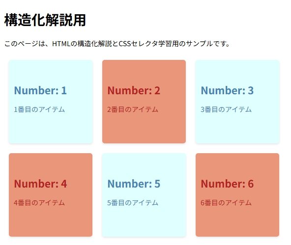
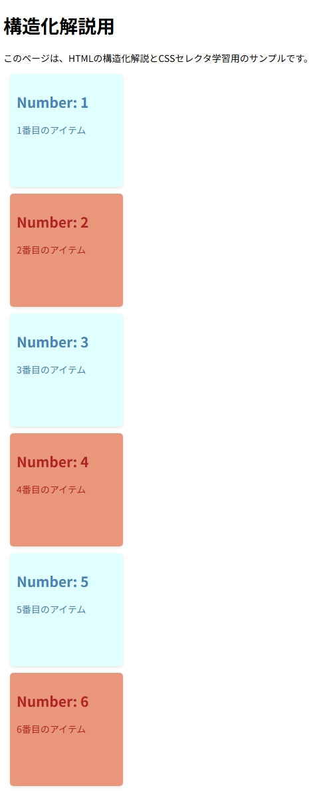
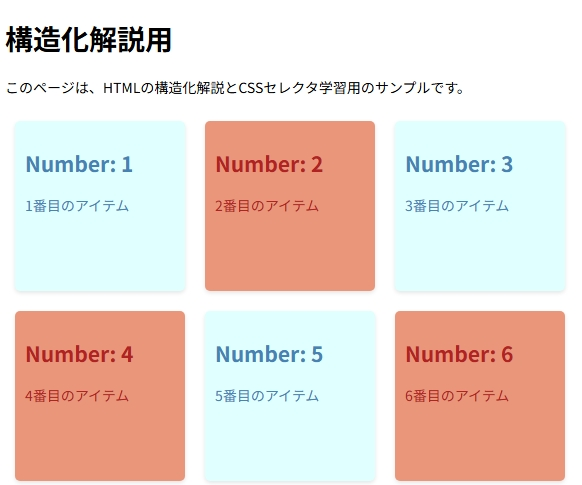

# Styleで装飾する - HTMLのスタイリング基礎

このディレクトリでは、HTML要素をCSSで装飾する基本的な方法を学びます。

## 目次
- [Styleで装飾する - HTMLのスタイリング基礎](#styleで装飾する---htmlのスタイリング基礎)
  - [目次](#目次)
  - [スタイルの基本](#スタイルの基本)
  - [インラインスタイル](#インラインスタイル)
    - [特徴](#特徴)
    - [使用例](#使用例)
  - [内部スタイルシート](#内部スタイルシート)
    - [特徴](#特徴-1)
    - [使用例](#使用例-1)
  - [外部スタイルシート](#外部スタイルシート)
    - [特徴](#特徴-2)
    - [使用例](#使用例-2)
  - [CSSクラスの書き方](#cssクラスの書き方)
    - [セレクタの基本](#セレクタの基本)
      - [セレクタの種類](#セレクタの種類)
      - [擬似クラス（サブクラス）](#擬似クラスサブクラス)
      - [セレクタの優先順位](#セレクタの優先順位)
        - [!importantによる優先順の強制変更](#importantによる優先順の強制変更)
      - [使用例](#使用例-3)
  - [学習方法](#学習方法)
    - [プロパティについて](#プロパティについて)
    - [セレクタについて](#セレクタについて)

## スタイルの基本

HTML要素を装飾する方法には以下の3つがあります：

1. **インラインスタイル**
   - 要素の`style`属性に直接記述
   - 例：`<p style="color: red;">テキスト</p>`

2. **内部スタイルシート**
   - `<head>`内の`<style>`タグに記述
   - 例：
     ```html
     <style>
       p { color: red; }
     </style>
     ```

3. **外部スタイルシート**
   - 別ファイル（.css）に記述して`<link>`で読み込み
   - 例：`<link rel="stylesheet" href="styles.css">`

## インラインスタイル

HTMLタグの`style`属性に直接スタイルを記載する方法です。
このディレクトリの[inline-style.html](./inline-style.html)がそのように記載されています。

### 特徴
- 良い点
  - HTMLタグに適用されているスタイルを探索する必要がないため、即時変更が可能
  - 内部スタイルシート方式、外部スタイルシート方式よりもスタイル適用の優先順が高い
    - 但し、`!important`宣言の方が優先されるという例外はある
- 悪い点
  - スコープはあくまで"記載されているタグ"のみになるため、類似のタグにも同じstyleを記載しなければならない
    - メンテナンス性は最も低い
  - ブラウザがページを描画する際、インラインスタイルはHTMLの解析時に都度スタイル計算が必要になるため、パフォーマンスは悪い
  - キャッシュされないため、この点もパフォーマンス向上にはならない

スコープの狭さと優先順の高さから「どうしてもこの要素にだけ、cssクラスの内容を逸脱したスタイルを設定したい」というようなケースでもない限り、インラインスタイルを使用することは避けてください。
筆者の場合、実業務では`left`, `top`, `margin`, `padding`といった位置調整目的でstyle要素を指定することはありますが、それ以外ではCSSクラスを用意します。

但し覚えておくべき点として、HTMLメールにおいてはスタイルシートは使えません。
メールクライアントはブラウザとは違い、外部リソースに大きな制約があるためブラウザと同じような手段でレイアウトを集約的に定義する手法は使えません。
そのため、インラインスタイルの記法は現在でも必要な知識と言えます。

### 使用例
```html
<div style="
  background-color: #f8f4ff;
  padding: 20px;
  border-radius: 8px;
  box-shadow: 0 2px 4px rgba(0,0,0,0.1);
">
  コンテンツ
</div>
```

## 内部スタイルシート
HTMLの`<head>`タグ内に`<style>`タグを記述し、その中にCSSを記載する方法です。
このディレクトリの[internal-file-style.html](./internal-file-style.html)がそのように記載されています。

### 特徴
- 良い点
  - HTMLファイル内にスタイルが記載されているため、ファイル管理が容易
  - 外部スタイルシートと比較して、HTTPリクエストが1回減る
  - インラインスタイルと比較して、同じスタイルを複数の要素に適用可能
- 悪い点
  - スコープはあくまで"記載されているHTMLファイル"のみになるため、複数のHTMLファイルで同じスタイルを使用する場合は、各ファイルに同じスタイルを記載する必要がある
    - メンテナンス性は外部スタイルシートより低い
  - HTMLファイルのサイズが大きくなる
  - ブラウザのキャッシュが効きにくい（HTMLファイルごとキャッシュされる）

複数ページで共通のスタイルを使用する場合は外部スタイルシートを使用することを推奨しますが、1ページのみの特殊なスタイルを適用する場合や、プロトタイプ作成時には内部スタイルシートも有効な選択肢となります。

### 使用例
``` html
<!DOCTYPE html>
<html>
  <head>
    <style type="text/css">
      .sampleClass {
        background-color: #f8f4ff;
        padding: 20px;
        border-radius: 8px;
        box-shadow: 0 2px 4px rgba(0,0,0,0.1);
      }
    </style>
  </head>
  <body>
    <div class="sampleClass"></div>
  </body>
</html>
```

## 外部スタイルシート
CSSを別ファイルとして作成し、HTMLファイルから`<link>`タグで読み込む方法です。
このディレクトリの[external-file-style.html](./external-file-style.html)と[css/style.css](./css/style.css), [css/theme.css](./css/theme.css)がその例となっています。

### 特徴
- 良い点
  - 複数のHTMLファイルで同じスタイルを使用可能
  - スタイルの一元管理が可能で、メンテナンス性が高い
  - ブラウザのキャッシュが効果的に機能する
    - CSSファイルは個別にキャッシュされ、2回目以降のページ読み込み時にはキャッシュから読み込まれる
    - HTMLファイルが更新されてもCSSファイルが変更されていなければキャッシュが使用される
    - 結果として、ページの読み込み時間が短縮され、帯域幅の使用量も削減される
  - HTMLとCSSの関心事が分離され、コードの可読性が向上
- 悪い点
  - 初回アクセス時は追加のHTTPリクエストが発生する
  - ファイル管理が必要（複数のファイルを扱う必要がある）
    - CSSファイルの分割単位の設計が重要（機能単位、コンポーネント単位など）
    - 命名規則やディレクトリ構造の設計方針を定め、チーム全体で遵守する必要がある
    - 方針が守られないと、重複したスタイルの定義や、ファイル間の依存関係の複雑化を招く
  - CDNやブラウザにキャッシュされている場合、更新の反映に時間がかかる可能性がある
    - キャッシュの有効期限を待つか、ファイル名やクエリパラメータを変更する必要がある
    - 緊急の修正が必要な場合に対応が難しい場合がある

一般的なWebサイト・Webアプリケーションでは、外部スタイルシートを使用することが推奨されます。

### 使用例
スタイルシート（style.css）
``` css
.sampleClass {
  background-color: #f8f4ff;
  padding: 20px;
  border-radius: 8px;
  box-shadow: 0 2px 4px rgba(0,0,0,0.1);
}
```
htmlファイル
``` html
<!DOCTYPE html>
<html>
  <head>
    <link type="text/css" rel="style.css">
  </head>
  <body>
    <div class="sampleClass"></div>
  </body>
</html>
```

## CSSクラスの書き方
インラインスタイルの場合、`{CSSプロパティ}: {値};`といいう記載のみで良いですがスタイルシートを使用する場合、CSSクラスを作成する必要があります。

``` css
{セレクタ} {
  {CSSプロパティ}: {値};
}
```

CSSを使いこなすには、セレクタの理解が最も重要です。
また、このセレクタの概念はjQueryなど多くのJavaScriptライブラリ・フレームワークにも適用されていますので、Webフロント開発の必須知識といえます。

### セレクタの基本

CSSセレクタは、HTML要素を選択してスタイルを適用するための仕組みです。セレクタを正しく理解することで、効率的かつ柔軟にスタイルを適用できます。

#### セレクタの種類

1. **要素セレクタ**
  - 特定のHTMLタグを選択します。
  - 例：`p { color: blue; }`（すべての`<p>`タグに適用）

2. **クラスセレクタ**
  - 特定のクラス属性を持つ要素を選択します。
  - 例：`.example { font-size: 16px; }`（`class="example"`を持つ要素に適用）

3. **IDセレクタ**
  - 特定のID属性を持つ要素を選択します。
  - 例：`#header { background-color: gray; }`（`id="header"`を持つ要素に適用）

4. **グループセレクタ**
  - 複数のセレクタをカンマで区切って指定します。
  - 例：`h1, h2, h3 { margin: 0; }`（`<h1>`、`<h2>`、`<h3>`要素に適用）

5. **子孫セレクタ**
  - 特定の親要素内の子孫要素を選択します。
  - 例：`div p { color: red; }`（`<div>`内のすべての`<p>`要素に適用）

6. **子セレクタ**
  - 特定の親要素の直下の子要素を選択します。
  - 例：`ul > li { list-style: none; }`（`<ul>`直下の`<li>`要素に適用）

7. **隣接セレクタ**
  - 特定の要素に隣接する要素を選択します。
  - 例：`h1 + p { font-style: italic; }`（`<h1>`の直後にある`<p>`要素に適用）

8. **属性セレクタ**
  - 特定の属性を持つ要素を選択します。
  - 例：`input[type="text"] { border: 1px solid black; }`（`type="text"`を持つ`<input>`要素に適用）

#### 擬似クラス（サブクラス）

擬似クラスは、特定の状態にある要素を選択するために使用します。以下は代表的な擬似クラスです：

1. **`:hover`**
  - ユーザーが要素にカーソルを合わせたときに適用されます。
  - 例：`a:hover { color: red; }`（リンクにカーソルを合わせたときに文字色を赤に変更）

2. **`:focus`**
  - ユーザーが要素をフォーカスしたときに適用されます。
  - 例：`input:focus { border-color: blue; }`（入力フィールドがフォーカスされたときに枠線を青に変更）

3. **`:active`**
  - ユーザーが要素をクリックしている間に適用されます。
  - 例：`button:active { background-color: gray; }`（ボタンをクリックしている間、背景色を灰色に変更）

4. **`:nth-child()`**
  - 親要素の中で特定の順番にある子要素を選択します。
  - 例：`li:nth-child(2) { color: green; }`（2番目の`<li>`要素に適用）

5. **`:first-child` / `:last-child`**
  - 親要素の最初または最後の子要素を選択します。
  - 例：`p:first-child { font-weight: bold; }`（最初の`<p>`要素を太字に）

6. **`:not()`**
  - 特定の条件に一致しない要素を選択します。
  - 例：`div:not(.excluded) { margin: 10px; }`（`class="excluded"`を持たない`<div>`要素に適用）

#### セレクタの優先順位

CSSでは、複数のセレクタが同じ要素に適用される場合、以下の優先順位に基づいてスタイルが決定されます。

1. インラインスタイル（例：`style="..."`）
1. IDセレクタ
1. クラスセレクタ、属性セレクタ、擬似クラス
1. 要素セレクタ、擬似要素

同じ優先順位の場合、後に記述されたスタイルが適用されます。
但し、`!important`宣言を指定することで、優先順位を強制的に変更できます。

##### !importantによる優先順の強制変更

`!important`宣言を使用すると、通常の優先順位を無視して強制的にスタイルを適用できます。
以下は`!important`の使用例です：

```css
/* 通常のスタイル */
.button {
  background-color: blue;
}

/* !importantによる強制上書き */
.special-button {
  background-color: red !important; /* 他のどのスタイルよりも優先される */
}
```

この場合、以下のようなマークアップでも赤色が適用されます：

```html
<!-- class="button"のスタイルは無視され、赤色が適用される -->
<button class="button special-button" style="background-color: green;">
  ボタン
</button>
```

**注意**: `!important`の過度な使用はスタイルの管理を複雑にするため、必要最小限に留めるべきです。

#### 使用例

```html
<!DOCTYPE html>
<html>
<head>
  <style>
   /* 要素セレクタ */
   p {
    color: blue;
   }

   /* クラスセレクタ */
   .highlight {
    background-color: yellow;
   }

   /* IDセレクタ */
   #main-title {
    font-size: 24px;
   }

   /* 擬似クラス */
   a:hover {
    color: red;
   }

   input:focus {
    border-color: blue;
   }
  </style>
</head>
<body>
  <h1 id="main-title">タイトル</h1>
  <p>通常の段落</p>
  <p class="highlight">ハイライトされた段落</p>
  <a href="#">リンク</a>
  <input type="text" placeholder="入力してください">
</body>
</html>
```

セレクタを適切に使い分けることで、効率的なスタイリングが可能になります。

## 学習方法

### プロパティについて

CSSプロパティは、調べればすぐに出てきますので覚える必要はありません。  
調べる際は、HTMLタグと同じく目的から逆引きできる情報ソースが良いでしょう。

[CSS目的別プロパティ](http://hpzeroguide.web.fc2.com/cssfile/css_dic_indexm.html)

これもCSSに限った話ではありませんが **「どう書けばいいか」** を覚える必要はありません。  
**「この技術で、何を実現できるか」** だけ覚えておけば、後で書き方を忘れてもすぐに調べなおして思い出すことができます。

### セレクタについて

セレクタは適切な記法を選択する必要があるため、プロパティよりもはるかに重要です。  
使い方を理解する必要があります。

セレクタの学習方法としては、スタイル適用先となるHTMLの構造をどのようにするかという点と併せて考えると効率的学習になります。

事例として、以下のようなHTMLを作成するシナリオを考えます。


これを実現するにあたり、まず最も単純にHTMLを組むと以下のような形が考えられます。
``` html
<div>
  <h2>Number: 1</h2>
  <p>1番目のアイテム</p>
</div>
<div>
  <h2>Number: 2</h2>
  <p>2番目のアイテム</p>
</div>
<div>
  <h2>Number: 3</h2>
  <p>3番目のアイテム</p>
</div>
<div>
  <h2>Number: 4</h2>
  <p>4番目のアイテム</p>
</div>
<div>
  <h2>Number: 5</h2>
  <p>5番目のアイテム</p>
</div>
<div>
  <h2>Number: 6</h2>
  <p>6番目のアイテム</p>
</div>
```

上記を起点としてCSSを組み上げていくとした場合、最も単純な方法としては各divタグにclass属性を振ってあげる事です。
奇数番は青、偶数番は赤表示ですので、都合3つのクラスを用意してやる必要があります。
``` html
<div class="itemWrapper odd">
  <h2>Number: 1</h2>
  <p>1番目のアイテム</p>
</div>
<div class="itemWrapper even">
  <h2>Number: 2</h2>
  <p>2番目のアイテム</p>
</div>
<div class="itemWrapper odd">
  <h2>Number: 3</h2>
  <p>3番目のアイテム</p>
</div>
<div class="itemWrapper even">
  <h2>Number: 4</h2>
  <p>4番目のアイテム</p>
</div>
<div class="itemWrapper odd">
  <h2>Number: 5</h2>
  <p>5番目のアイテム</p>
</div>
<div class="itemWrapper even">
  <h2>Number: 6</h2>
  <p>6番目のアイテム</p>
</div>
```

``` css
.itemWrapper {
  margin: 10px;
  padding: 10px;
  width: 150px;
  height: 150px;
  border-radius: 5px;
  box-shadow: 0 2px 4px rgba(0, 0, 0, 0.1);
}

.odd {
  background-color: lightcyan;
  color: steelblue;
}

.even {
  background-color: darksalmon;
  color: firebrick
}
```

この時点での結果は以下の通りです。


次にやりたい作業としては、3列 x 2行の表示にすることです。
この方法としてはFlex Designを使用します。

Flexについては、以下が非常に分かりやすいので参考にしてください。
https://www.webcreatorbox.com/blog/css-flexbox-cheat-sheet

Flexを適用するにあたっては、まず各アイテムのルートとなる要素を用意する必要があります。
アイテム1～6をUI上で列挙する、という目的で`<ul>`タグを用います。
``` html
<ul class="itemContainer">
  <li>
    <div class="itemWrapper odd">
      <h2>Number: 1</h2>
      <p>1番目のアイテム</p>
    </div>
  </li>
  <li>
    <div class="itemWrapper even">
      <h2>Number: 2</h2>
      <p>2番目のアイテム</p>
    </div>
  </li>
  <li>
    <div class="itemWrapper odd">
      <h2>Number: 3</h2>
      <p>3番目のアイテム</p>
    </div>
  </li>
  <li>
    <div class="itemWrapper even">
      <h2>Number: 4</h2>
      <p>4番目のアイテム</p>
    </div>    
  </li>
  <li>
    <div class="itemWrapper odd">
      <h2>Number: 5</h2>
      <p>5番目のアイテム</p>
    </div>    
  </li>
  <li>
    <div class="itemWrapper even">
      <h2>Number: 6</h2>
      <p>6番目のアイテム</p>
    </div>    
  </li>
</ul>
```

cssには、.itemContainerを追加します。
``` css
.itemContainer {
  list-style-type: none;
  padding: 0;
  margin: 0;
  width: 600px;
  display: flex;
  flex-wrap: wrap;
  align-items: flex-start;
}

.itemWrapper {
  margin: 10px;
  padding: 10px;
  width: 150px;
  height: 150px;
  border-radius: 5px;
  box-shadow: 0 2px 4px rgba(0, 0, 0, 0.1);
}

.odd {
  background-color: lightcyan;
  color: steelblue;
}

.even {
  background-color: darksalmon;
  color: firebrick
}
```

結果としては、以下のようになります。


一見正しい結論に見えますが、ここで定義したhtml, cssには以下の問題があります。

- cssに定義した合計4つのclassは、関連性を持つが構造化されていないため、可読性が悪い
  - 類似のレイアウトを作成しようとした際、何がどこに定義されていて、必要に応じてコピペ仕様とした際に追跡対象が多くなる
- アイテムを増やそうとした場合、`.odd`,`.even`の順番を気にしなければならない
  - 特に途中にアイテムを追加しようとした場合、各アイテムの順番を再整理しなければならない
  - アイテムをバックエンドから受け取ったデータで動的に生成しようとした場合、`.odd` Or `.even`クラスのどちらを付与するか、javaScriptなりC#の処理を記載しなければならない
- 仮にこのcssがすべての画面共通使用するcssファイルに定義していた場合、これらのクラス名は予約語となるので新たにクラスを生成する場合の選択肢を4つも潰してしまう
  - 改修容易性に支障をきたす

等々、可読性・保守性といった観点で非常に多くの問題があります。
これを解決するには「ルート要素である`.itemContainer`配下にはこれを適用する」というような表現をすればよいです。
``` html
<ul class="itemContainer">
  <li>
    <div>
      <h2>Number: 1</h2>
      <p>1番目のアイテム</p>
    </div>
  </li>
  <li>
    <div>
      <h2>Number: 2</h2>
      <p>2番目のアイテム</p>
    </div>
  </li>
  <li>
    <div>
      <h2>Number: 3</h2>
      <p>3番目のアイテム</p>
    </div>
  </li>
  <li>
    <div>
      <h2>Number: 4</h2>
      <p>4番目のアイテム</p>
    </div>
  </li>
  <li>
    <div>
      <h2>Number: 5</h2>
      <p>5番目のアイテム</p>
    </div>
  </li>
  <li>
    <div>
      <h2>Number: 6</h2>
      <p>6番目のアイテム</p>
    </div>
  </li>
</ul>
```
cssは`itemContainer`を起点として、その配下に対する子孫セレクタ・子セレクタを用いて実現します。
偶数 Or 奇数アイテムへの適用ルールは、`:nth-child`を活用します。
``` css
/* コンテナに適用するスタイル */
.itemContainer {
  list-style-type: none;
  padding: 0;
  margin: 0;
  width: 600px;
  display: flex;
  flex-wrap: wrap;
  align-items: flex-start;
}

/* リストアイテム内のラッパ(div)に適用するスタイル */
.itemContainer li > div {
  margin: 10px;
  padding: 10px;
  width: 150px;
  height: 150px;
  border-radius: 5px;
  box-shadow: 0 2px 4px rgba(0, 0, 0, 0.1);
}

/* 偶数と奇数のリストアイテムに異なるスタイルを適用 */
/* 奇数のリストアイテム */
.itemContainer li:nth-child(odd) > div {
  background-color: lightcyan;
  color: steelblue;
}

/* 偶数のリストアイテム */
.itemContainer li:nth-child(even) > div {
  background-color: darksalmon;
  color: firebrick
}
```
これにより、以下のメリットが得られます。

- `class="itemContainer"`のみ定義しているため、1つのクラス名だけを検索すれば関連するcss設定を完全に追跡できる
  - 可読性向上
  - 予約語の消費を少なく抑えられる
- `class`設定を宣言する回数を減らして、htmlをシンプルに保てる

最終的な結果は、[このファイル](./sample-selector.html)に記載してあります。

この理想的結果を最初から引き出すためには、html作成時にルート要素（この事例で言うところの`<ul>`）の存在に気付くことが重要です。
カテゴリ毎のルート要素を見つけ、そのカテゴリが現在作成中の画面以外でも使用するものなのか、そうでないのかによってどのcssファイルに記載するのかが決まります。

カテゴライズとcss切り分けにの具体的手法については正解はありません。
生成AIを活用したいところですが、AIにcssの「再利用性」という利点を上手く考慮させるのは現時点では困難と思っています。  
生成AI任せだと、保守性が悪いプロダクトが出来上がる可能性が高いので、どうしても人の手を加える必要があります。

古典的手法ですが、筆者は今でもデザインの最初から作成する際は紙にレイアウト案を印刷します。
そして幾つかの色で「ラッパー」「コンテナ」「コンポーネント」の分類毎に同じ色で囲んでいき、それぞれのcssをどのレベルのファイル（全体共通, 機能カテゴリ, 画面固有などの分類がある）に記載するか決めるという方法を採ります。
